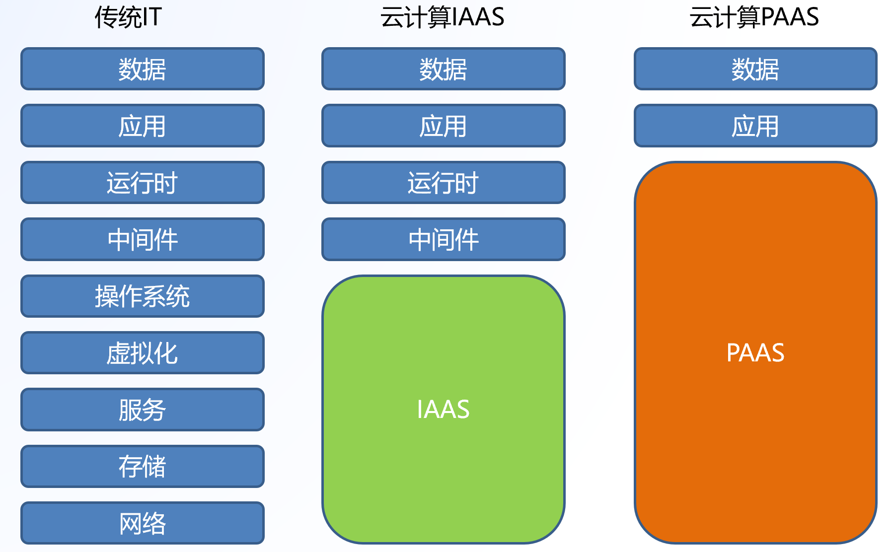
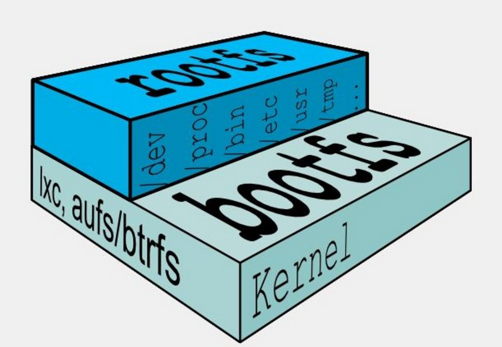
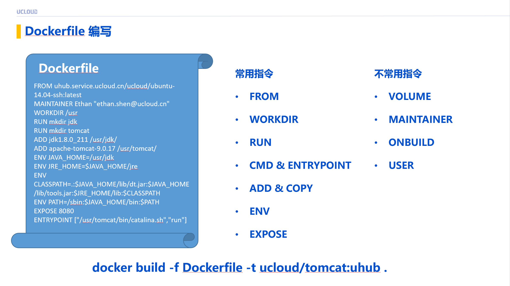
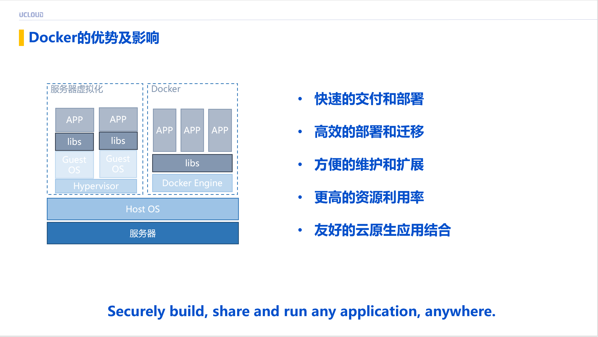
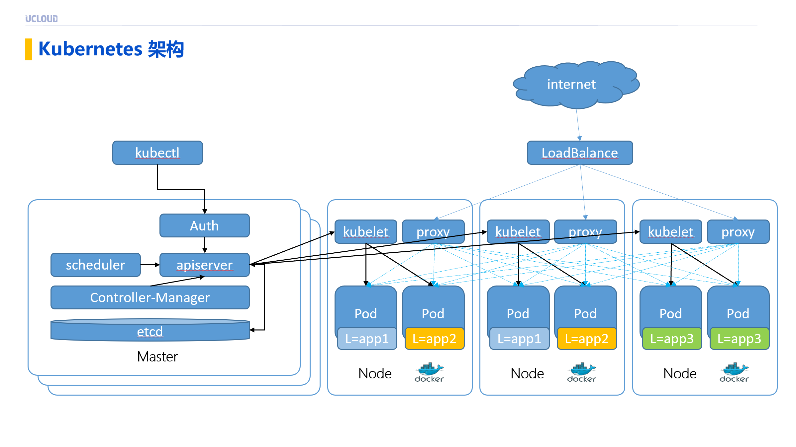
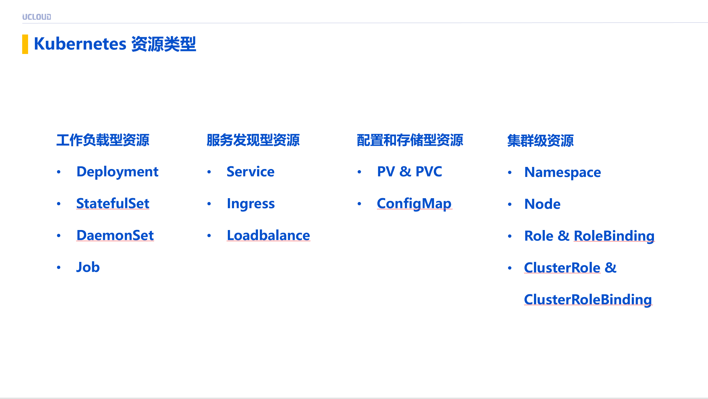
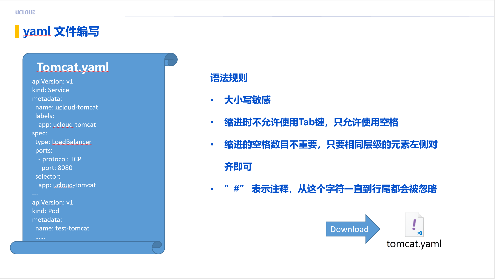

# 从Linux小白到入门kubernetes，普通成年人需要多久？

[TOC]

## 学习思路

在我看来，时间是根据个人的基础和学习能力、喜爱程度来定的，我在这里分享一下我的学习经历，接下来我不会讲太多的操作，大部分是心法，有了心法一通百通，招式千变万化。

### 学习linux

#### 首先先了解cd ls这些命令

这些就像你在windows系统里面打开一个文件夹看里面有什么一样，把你不会的英文单词记录下来，比较有效的就是把你的windows改成英文系统，强迫自己提升常用系统的英文单词，有些是和Linux相通的。

#### 了解YUM 操作

这就像现在很多的应用商店，让自己习惯去看一些命令内容，去理解命令内容把它幻想成为你们平时用的手机app store，当然你也可以开发一个应用安装到linux服务器。

#### 了解客户端/服务端

这里就不详细展开B/S C/S这些，但都是客户端和服务端，你的手机微信点开以后你能和你的朋友交流沟通，那你一定能想象到，你们的沟通背后有个服务器，这个服务器就是服务端，你手机就是客户端。

#### 服务端安装在Linux上

上面拿微信举例了，世界上有差不多80%以上的服务端部署在linux服务器上，这其实和我们在上面讲的YUM安装一样，我们做了一个程序，安装在了linux服务器上，为远端的客户端提供了连接通讯计算服务。

#### 至于linux Kernel

我觉得你现阶段可以不用深入理解，有兴趣可以了解linux系统是如何运作的，操作系统为什么有区别等等的问题。

### 理解应用安装

#### 你的应用的部署方式

你开发了一个应用或者你的team开发了一个应用，你把他部署到Linux服务器上，你会发现他对于你的linux服务器要求不尽相同，会有很多问题出现，部署到CentOS、Ubuntu是完全不一样的，这里提出一个思考，你的应用如何适合所有操作系统呢？

#### 中间件的出现

Tomcat是java应用使用最多的中间件，它出现的目的就是衔接你的应用和操作系统之间的不同，提供了一个衔接的功能，让你的应用不再对于操作系统拥有强依赖，当然这解决了一大部分问题不是全部。

#### 这里插入一个云计算的分层

看看我们刚才说的几个层面都在哪

#### 你的安装依然很痛苦

这里开始要有代入感，你可以不开发 不运维 只学习，你的操作可以完全用tomcat nginx apache这类中间件看他的默认页面，你尝试去不同的操作系统安装这些中间件，你会发现你的操作系统版本、中间件版本你都要去进行不同的调整。

### 容器化应用

#### 容器管理软件

docker容器化管理软件是linux上的一个应用，它会帮助你将你容器化的应用发布到你的linux服务器，它会帮助你限制你应用的资源使用和中间件以下的适配问题。

#### 为什么它能解决适配操作系统问题？

简单的再回去讲一下Linux系统的组成，典型linux启动到运行需要2个FS，rootfs+bootfs。
rootfs主要包含linux系统中的标准目录和文件，对于各种Linux发行版都是在rootfs上有差别，bootfs基本相同，在容器运行时会对中间件镜像来说，都对于中间件依赖的bootfs安装到了镜像中。

#### 如何做容器镜像呢？

这里是可以忽略的，可以使用一些官方nginx镜像，有兴趣可以深入研究如何做一个镜像，在这里镜像叫做image。

#### 容器和刚才讲的虚拟机部署有什么区别？

看图即可

### kubernetes

#### 为什么还需要kubernetes？

kubernetes是一个开源的容器管理平台，它负责帮你管理调度你的容器应用。

#### 为什么说kubernetes是下一代数据中心操作系统？

除上面说到的以外，使用kubernetes你几乎可以不需要再去管理你的linux操作系统，你可以直接管理你的应用，从云计算分层来说，它属于paas层，使用者就不需要再去管理paas层以下的那些东西了。

### 怎么学习kubernetes？

#### 查文档

在k8s学习中，和后面你可能面对的CKA考试，里面的宗旨就是去查文档，不要过度迷恋如何安装k8s，kubeadm出现的目的就是简化安装，各大云厂商也是，在这里你需要学会的是如何使用。

#### kubernetes架构
我觉得你看到这了距离成功就不远了,这里你开始通过k8s(接下来kubernetes我会简称k8s)管理你的容器应用了，架构如下，你使用kubectl客户端工具去操作你的k8s服务端(客户端服务端的概念见前面)，这个服务端就会帮你去做你前面手动做的这些过程。

#### kubernetes抽象了什么？

在k8s中使用起来困难我觉得最重要的是了解k8s资源对象，这些抽象是面向应用的，不再是面向Linux操作系统了

#### yaml文件编写

在k8s中使用yaml文件进行应用所需要的声明，然后将应用进行部署

#### kubectl客户端使用

它将完成你的yaml文件传给k8s的api-server进行后面的部署。可以查查文档，全部都有哦。前面提到的抽象的理解是我觉得非常重要的，至于yaml，我觉得都可以从文档中查询到。

#### 结束了吗？

当你完成了k8s的学习，才刚刚开始，你进入了一个新的世界，你不会再去操作Linux操作系统（当然这不代表他不重要，也是必须学习的部分），你在这个世界里还需要面对应用的日志、监控、CICD、云原生应用其中的很多坑，得去学习。

### 我用了多久？

#### Linux&部署一个应用
差不多是05年左右，用的CentOS 5.x，这完全是好奇心的开始，部署了一个游戏私服。至于现在我也没有完全玩明白Linux操作系统，书太厚内容太多，学习时间也就一两个月吧，大部分都是照着文档操作多练就记住了。

#### docker
2015年的春节，没有回家，在公司值班，开始玩docker，那个时候的云主机启动差不多5分钟，而docker启动一个服务只需要几十秒，这也刺激到了我的好奇心，觉得这是未来的发展。学习的话只是春节值班过程中的空闲时间。

#### kubernetes
2017年开始接触kubernetes，也只是借由容器化的知识进行学习，权威指南大概看了2个月吧，剩下的就是实际使用中自己的提炼了，祝你好运。

