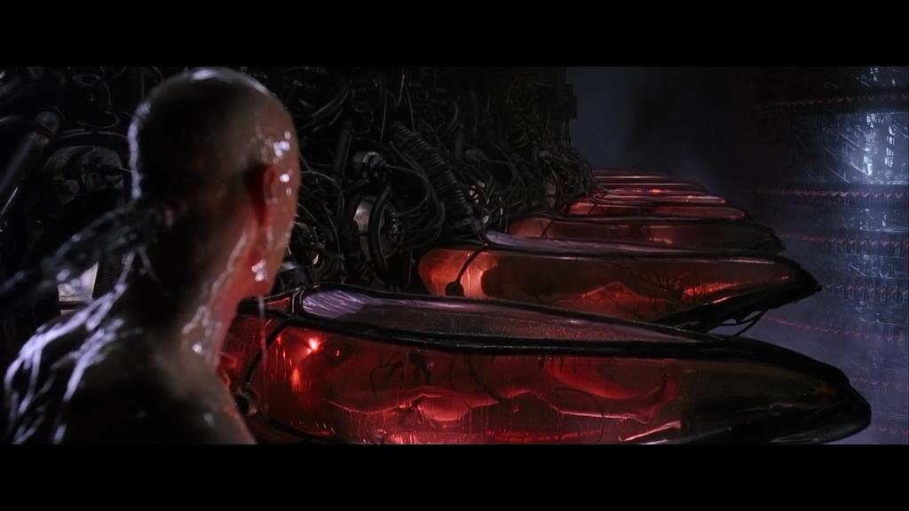
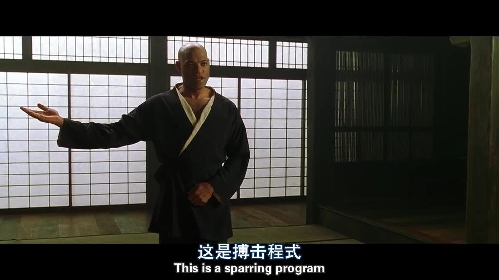

# 如何通俗解释docker是什么？

[TOC]

既然是通俗易懂来解释docker是什么，我来举个栗子

### 黑客帝国，侬看过伐？

#### 这是一个服务器矩阵，这里的人是程序，每个人都是通过仓(docker实例)与这个世界连接的

docker达到了最大化使用资源和标准化管理，其中每个仓(docker实例)都是自给自足自包含的。

#### 你作为一个程序可以在这学习新的技能(程序迭代)

在docker的世界中运行一个docker实例，需要一个镜像，你的程序迭代后需要重新build镜像，重新运行容器实例与世界连接。

#### 在连接的世界里，由于场景需要忽然扩展很多的同样功能的人(docker实例提供的服务)，那就快速扩呗

docker可以快速创建docker实例，镜像(image)小，不会修改镜像中的程序

#### 小结一下

1. docker是一款容器运行时管理软件
2. docker实例是真正运行程序的容器，它自包含所有需要，它提供了与世界连接的功能(网络)
3. docker可以通过镜像(image)快速创建多个实例的同一个应用(分布式)对外提供服务，快速，更小的消耗
4. 你要迭代你的程序需要重新迭代你的镜像(image)

